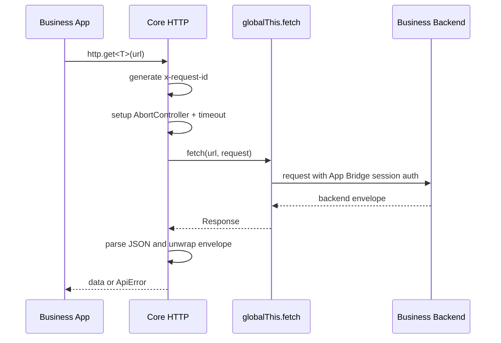

# Core HTTP / Error 设计与实现说明

## 1. 背景

`@standhigher/shopify-app-kit` 已经包含 Provider、Feedback、Save Flow、Navigation、Resource Picker、Analytics 等面向 Shopify embedded app 的前端能力。多个业务 app 在接入这些能力时，还会重复实现后端请求、超时控制、错误归一、request id 追踪和统一响应解包。

本次 `0.3.0` 新增 Core 层的 HTTP 与 Error 模块，用于把这些底层通用能力沉淀到包内，降低业务 app 的重复实现成本。

## 2. 目标与非目标

目标：

- 提供统一的 HTTP client：`get`、`post`、`put`、`delete`。
- 统一处理 `globalThis.fetch`、timeout、`AbortController`、request id、GET retry 和响应解包。
- 提供统一错误模型 `ApiError` 与 `normalizeError`。
- 对外使用扁平 subpath：`@standhigher/shopify-app-kit/http`、`@standhigher/shopify-app-kit/error`。
- 保持现有 Features / Runtime / Adapters 架构不变。

非目标：

- 不手动获取或暴露 Shopify session token。
- 不直接请求 Shopify Admin API 或 Shopify App Events API。
- 不替业务后端实现 OAuth、Webhook、鉴权、计费或权限判断。
- 不暴露内部路径，例如 `@standhigher/shopify-app-kit/core/http`。

## 3. 模块结构

```text
packages/shopify-app-kit/src/
├── core/
│   ├── error/
│   │   ├── ApiError.ts
│   │   ├── error-types.ts
│   │   ├── index.ts
│   │   └── normalizeError.ts
│   └── http/
│       ├── createHttpClient.ts
│       ├── http-types.ts
│       └── index.ts
├── error.ts
├── http.ts
└── core.ts
```

说明：

- `src/core/http` 和 `src/core/error` 是内部实现目录。
- `src/http.ts` 和 `src/error.ts` 是公开 subpath 入口。
- `src/core.ts` 继续保留已有 Provider / Runtime 导出，并聚合导出 HTTP / Error，保持兼容。

## 4. 对外 API

HTTP：

```ts
import { http, createHttpClient } from "@standhigher/shopify-app-kit/http";

const data = await http.get<MyData>("/api/settings");
await http.post("/api/settings", data);
```

Error：

```ts
import { ApiError, normalizeError } from "@standhigher/shopify-app-kit/error";

try {
  await http.get("/api/settings");
} catch (error) {
  if (error instanceof ApiError) {
    console.error(error.code, error.requestId);
  }
}
```

package exports：

```json
{
  "./http": {
    "types": "./dist/http.d.ts",
    "import": "./dist/http.js",
    "require": "./dist/http.cjs"
  },
  "./error": {
    "types": "./dist/error.d.ts",
    "import": "./dist/error.js",
    "require": "./dist/error.cjs"
  }
}
```

## 5. 后端响应契约

前后端统一响应格式：

```json
{
  "code": "SUCCESS",
  "message": "success",
  "data": {},
  "traceId": "d269fc99a56d0c2053c7b1b824b9f8d0",
  "details": "可选错误详情"
}
```

字段规则：

- `code`：必填，业务状态码。
- `message`：必填，业务消息。
- `data`：必填，成功响应数据；无数据时建议返回 `null` 或 `{}`。
- `traceId`：必填，后端链路追踪 id。
- `details`：可选，错误详情或额外上下文。

客户端处理规则：

- `code === "SUCCESS"`：返回 `data`。
- `code !== "SUCCESS"`：抛出 `ApiError`。
- `traceId` 会映射为 `ApiError.requestId`。

## 6. HTTP 请求流程



普通 HTTP 请求依赖 Shopify App Bridge 增强后的 `globalThis.fetch` 自动附加 session authentication。本包不手动获取 session token，避免把认证细节暴露到通用前端工具层。

## 7. Timeout 设计

默认 timeout 为 `15000ms`。

实现方式：

- 每次请求创建一个新的 `AbortController`。
- 使用 `setTimeout` 在超时后执行 `controller.abort()`。
- 请求结束后在 `finally` 中清理 timeout id。

归一化规则：

- `AbortError` 会被转换为 `ApiError`。
- 默认 `code` 为 `TIMEOUT`。
- 默认 `message` 为 `Request timed out`。
- `requestId` 保留为本次请求生成或调用方传入的 id。

## 8. Retry 设计

默认 retry 次数为 `1`，仅对 `GET` 生效。

默认可重试场景：

- 网络错误。
- timeout。
- HTTP `5xx`。

默认不重试：

- `POST`、`PUT`、`DELETE`。
- HTTP `4xx`。
- 后端返回的业务错误，例如 `code !== "SUCCESS"`。

设计原因：

- `GET` 通常是幂等读取，默认重试风险较低。
- 写操作是否幂等取决于业务语义，默认不重试，避免重复创建、重复扣费、重复提交。
- 业务如需对写操作重试，应在业务层结合 idempotency key 单独处理。

## 9. Request Id 设计

每次请求都会设置 `x-request-id`：

- 优先使用调用方传入的 `requestOptions.requestId`。
- 否则使用 `HttpClientOptions.requestId()`。
- 如果未配置，则使用 `crypto.randomUUID()`。
- 无 `crypto.randomUUID()` 时使用时间戳和随机字符串 fallback。

错误映射：

- 后端 envelope 中的 `traceId` 优先映射到 `ApiError.requestId`。
- 网络错误和 timeout 使用客户端生成的 request id。

这样前端日志、后端日志和链路追踪可以围绕同一个 id 排查问题。

## 10. Error 模型

```ts
interface ApiError {
  code: string;
  message: string;
  status?: number;
  requestId?: string;
  details?: unknown;
}
```

错误来源映射：

| 来源 | code | 说明 |
|---|---|---|
| 后端业务错误 | 后端 `code` | 保留后端 `message`、`details`、`traceId` |
| HTTP 非 2xx 且无标准 envelope | `HTTP_ERROR` | `details` 保存响应体 |
| timeout | `TIMEOUT` | 由 `AbortError` 归一 |
| 网络异常 | `NETWORK_ERROR` | 由 `Error` 归一 |
| 未知异常 | `UNKNOWN_ERROR` | `details` 保存原始值 |

建议业务 feature 边界捕获 `ApiError` 后：

- 用 `message` 渲染用户反馈。
- 用 `code` 做业务分支判断。
- 用 `requestId` 对接日志和排障。
- 谨慎展示 `details`，默认只进入日志。

## 11. 构建与导出配置

新增 public subpath 涉及以下配置：

- `packages/shopify-app-kit/package.json`：新增 `./http`、`./error` exports。
- `packages/shopify-app-kit/tsup.config.ts`：新增 `http`、`error` entry。
- `packages/shopify-app-kit/tsconfig.json`：新增本地 path alias。
- `packages/shopify-app-kit/vitest.config.ts`：新增测试 alias。
- `packages/shopify-app-kit/scripts/build-storybook-placeholder.mjs`：新增 Core 文档检查。

构建后会产出：

```text
dist/http.js
dist/http.cjs
dist/http.d.ts
dist/error.js
dist/error.cjs
dist/error.d.ts
```

## 12. 测试覆盖

新增测试文件：

- `src/http.test.ts`
- `src/error.test.ts`

覆盖场景：

- 成功 envelope 解包并返回 `data`。
- 自动发送 `x-request-id`。
- 后端业务错误归一为 `ApiError`。
- GET 网络错误默认重试。
- POST 默认不重试。
- timeout 归一为 `TIMEOUT`。
- 默认 `http` client 导出。
- `normalizeError` 处理后端 envelope 和未知错误。

## 13. 发布影响

版本：`0.3.0`。

变更类型：新增公开 API，属于 minor 版本更新。

发布内容包含：

- `@standhigher/shopify-app-kit/http`
- `@standhigher/shopify-app-kit/error`
- 英文 Core 文档：`docs/core.md`
- 中文 Core 文档：`docs/core.zh-CN.md`
- 本设计实现说明：`docs/core-http-error-design.zh-CN.md`

发布前验证命令：

```bash
git diff --check
npm run lint
npm run test
npm run typecheck
npm run build
npm run build-storybook
cd packages/shopify-app-kit
npm pack --dry-run --registry=https://registry.npmjs.org/
```

## 14. 后续演进建议

- 增加 retry backoff 默认策略，例如指数退避和 jitter。
- 增加可选的 `onRequest`、`onResponse`、`onError` hooks，便于业务接入日志和埋点。
- 增加 GraphQL error 结构识别。
- 增加更细的业务错误类型守卫，例如 `isApiErrorCode(error, code)`。
- 与未来真实 Storybook / Demo 示例联动，展示业务接入方式。
